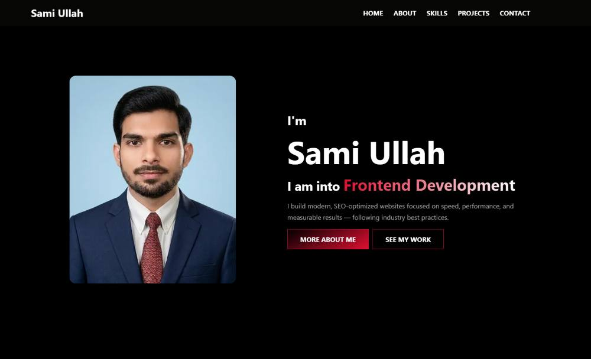
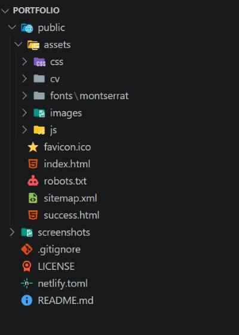

<h1 align="center">Sami Ullah — Frontend Developer Portfolio</h1>

  <strong>A modern, responsive, high-performance personal portfolio</strong> 
  Built with pure HTML, CSS &amp; JavaScript — deployed on Netlify.

  
  
  
  
  
  

---
### Hero

### Project Structure

## 📖 About

This is the personal portfolio website of **Sami Ullah**, a Frontend Developer passionate about crafting modern, responsive, and accessible user interfaces. The site features an about section, a technical skills grid, a featured project showcase, and a fully functional Netlify-powered contact form — all wrapped in a clean, polished, and mobile-first design.

## ✨ Features

- **Responsive design** — looks great on every screen size
- **Skills showcase** — inline SVG icons for a crisp, fast experience
- **Featured project section** — live project showcase with tech tags
- **Contact form** — handled natively by Netlify Forms
- **Resume download** — one-click downloadable resume
- **SEO & accessibility** — semantic HTML, meta tags, Open Graph & Twitter cards
- **Structured data** — JSON-LD for rich search results

## 🌐 Deployment

Deployment is handled automatically by **Netlify**:

- Publish directory: `public/`
- Config file: [`netlify.toml`](netlify.toml)
- Live site: [samiullah.netlify.app](https://samiullah.netlify.app/)

## 📬 Contact

- **Email:** [samiwebdev12@gmail.com](mailto:samiwebdev12@gmail.com)
- **GitHub:** [@samiwebdev12](https://github.com/samiwebdev12)
- **LinkedIn:** [Sami Ullah](https://www.linkedin.com/in/sami-ullah-3365a2432)
- **X / Twitter:** [@samiwebdev](https://x.com/samiwebdev)

## 📄 License

Distributed under the [MIT License](LICENSE).